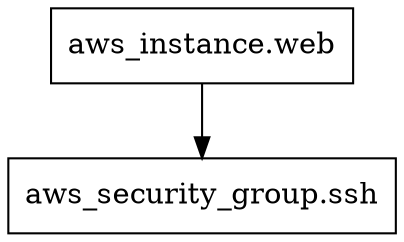

# 10 — Visualizing Execution Plans

> **Exam objective:** Know the tools available to visualize and inspect execution plans.

---

## Why Visualize?

Text-based plan output is great for small changes, but for large infrastructure changes it helps to have:
- A **visual diff** of what's changing
- A **dependency map** to understand order of operations
- **Machine-readable output** for policy checks or custom tooling

---

## Method 1: `terraform show` (Human-Readable)

The simplest visualization — renders a saved plan as human-readable text:

```bash
terraform plan -out=plan.tfplan
terraform show plan.tfplan
```

Output:

```
# aws_instance.web will be created
+ resource "aws_instance" "web" {
    + ami           = "ami-0c55b159cbfafe1f0"
    + instance_type = "t3.micro"
    + id            = (known after apply)
    ...
  }

Plan: 1 to add, 0 to change, 0 to destroy.
```

---

## Method 2: `terraform show -json` (Machine-Readable)

The JSON format is the most powerful — enables automation, policy enforcement, and custom tooling:

```bash
terraform show -json plan.tfplan
```

The JSON output has a top-level structure:

```json
{
  "format_version": "1.2",
  "terraform_version": "1.7.0",
  "resource_changes": [
    {
      "address": "aws_instance.web",
      "type": "aws_instance",
      "name": "web",
      "change": {
        "actions": ["create"],
        "before": null,
        "after": {
          "ami": "ami-0c55b159cbfafe1f0",
          "instance_type": "t3.micro"
        },
        "after_unknown": {
          "id": true,
          "public_ip": true
        }
      }
    }
  ],
  "configuration": { ... },
  "planned_values": { ... }
}
```

### Useful `jq` Queries

```bash
# All resources that will be created
terraform show -json plan.tfplan | \
  jq '.resource_changes[] | select(.change.actions[] == "create") | .address'

# All resources that will be destroyed
terraform show -json plan.tfplan | \
  jq '.resource_changes[] | select(.change.actions[] == "delete") | .address'

# Summary count by action
terraform show -json plan.tfplan | \
  jq '[.resource_changes[].change.actions[]] | group_by(.) | map({(.[0]): length}) | add'
```

---

## Method 3: `terraform graph` (Dependency Graph)

`terraform graph` outputs the **dependency graph** in [DOT format](https://graphviz.org/doc/info/lang.html) — the same format used by Graphviz.

```bash
terraform graph
```

Sample output:


### Render the Graph as an Image

You need Graphviz installed:

```bash
# macOS
brew install graphviz

# Ubuntu
sudo apt install graphviz
```

```bash
# Render to PNG
terraform graph | dot -Tpng > graph.png

# Render to SVG (scalable, recommended for large graphs)
terraform graph | dot -Tsvg > graph.svg

# Open in browser (macOS)
open graph.svg
```

### Plan-Specific Graph

You can generate a graph specifically for a plan phase (shows the apply order):

```bash
terraform graph -type=plan | dot -Tsvg > plan-graph.svg
terraform graph -type=apply | dot -Tsvg > apply-graph.svg
```

| Graph type | Shows |
|---|---|
| `plan` | Resource evaluation order for planning |
| `apply` | Resource creation/update order for applying |
| `plan-destroy` | Evaluation order for destroy |

---

## Method 4: Third-Party Visualization Tools

Several community tools make plan reading easier:

### Rover

[Rover](https://github.com/im2nguyen/rover) generates an interactive HTML visualization of your Terraform plan and state:

```bash
# Install (macOS)
brew install im2nguyen/tap/rover

# Generate visualization
rover -planJSONPath=plan.json
# Opens browser with interactive graph
```

### Infracost

[Infracost](https://infracost.io) shows the **cost impact** of your plan:

```bash
npm install -g infracost
infracost breakdown --path .
infracost diff --path . --compare-to previous-costs.json
```

### Blast Radius

[Blast Radius](https://github.com/28mm/blast-radius) is a D3.js visualization tool for Terraform dependency graphs.

### Checkov / Terrascan

These tools scan your plan JSON for security and compliance issues:

```bash
# Checkov
pip install checkov
terraform plan -out=plan.tfplan
terraform show -json plan.tfplan > plan.json
checkov -f plan.json
```

---

## Hands-On: Plan Visualization End-to-End

```bash
# 1. Write a multi-resource config (reuse your 04-up-and-running example or create new)
# 2. Plan and save
terraform plan -out=myplan.tfplan

# 3. Human-readable
terraform show myplan.tfplan

# 4. JSON output
terraform show -json myplan.tfplan | jq '.'

# 5. List all changes with their actions
terraform show -json myplan.tfplan | \
  jq '.resource_changes[] | {address, actions: .change.actions}'

# 6. Generate dependency graph (requires graphviz)
terraform graph | dot -Tsvg > dependency-graph.svg
```

---

## Exam Tips

- `terraform show <plan-file>` renders a saved plan as human-readable text.
- `terraform show -json <plan-file>` outputs the plan in JSON — parseable by tools.
- `terraform graph` outputs DOT format — needs Graphviz (`dot`) to render.
- Know the graph types: `plan`, `apply`, `plan-destroy`.
- Third-party tools (Rover, Infracost, Checkov) are common in the ecosystem but not part of the core CLI.

---

## Further Reading

| Resource | URL |
|---|---|
| `terraform show` | https://developer.hashicorp.com/terraform/cli/commands/show |
| `terraform graph` | https://developer.hashicorp.com/terraform/cli/commands/graph |
| JSON Plan Format | https://developer.hashicorp.com/terraform/internals/json-format |
| Graphviz | https://graphviz.org |
| Rover | https://github.com/im2nguyen/rover |
| Infracost | https://www.infracost.io |

---

*Next: [11 — Resource Graph](./11-resource-graph.md)*
